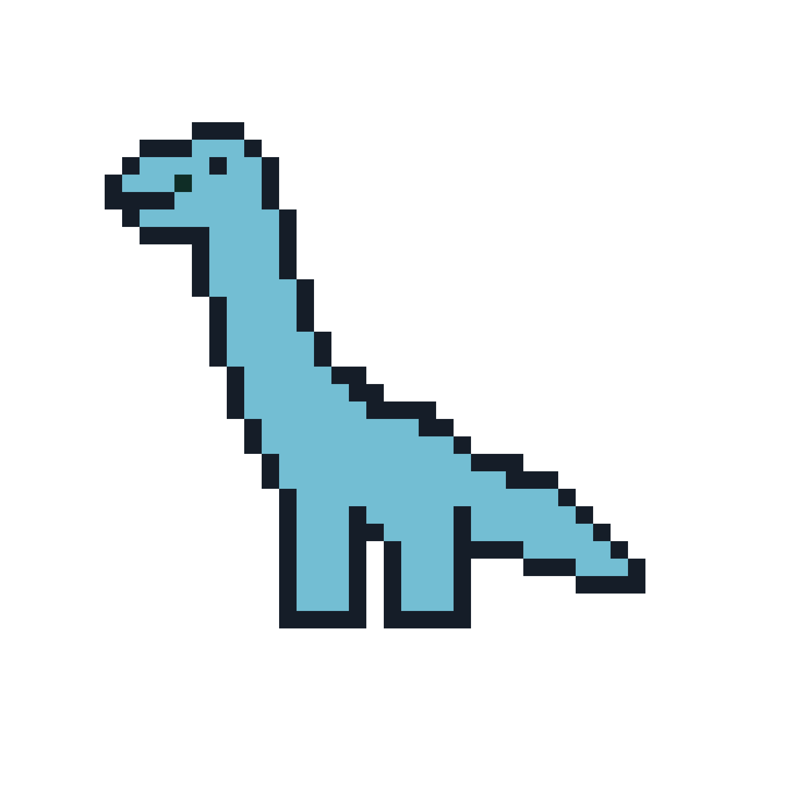

# **Dino blocks: Aprende Programación Jugando**

Bienvenido a **Dino blocks**, la página web que hace que aprender programación sea divertido y accesible para para niños de todas las edades. Nuestro objetivo es inspirar a la próxima generación de programadores y fomentar el pensamiento lógico y la creatividad desde una edad temprana.

### **Juegos Educativos**
- **Rompecabezas desafiantes:** Resuelve rompecabezas y desafíos de programación que se vuelven cada vez más complejos a medida que avanzas.
- **Juegos divertidos:** Juega juegos adictivos que te enseñarán conceptos de programación sin que te des cuenta.

## **¿Por qué elegir Dino Blocks?**
- **Aprender jugando:** Hacemos que aprender programación sea una experiencia divertida y atractiva para los niños.
- **Desarrollo de habilidades:** Fomentamos el pensamiento lógico, la resolución de problemas y la creatividad desde una edad temprana.
- **Seguro y supervisado:** CodeKids es seguro para niños y está supervisado por expertos en educación.

## **¡Comienza a programar con CodeKids hoy mismo!**
Visita [nuestro sitio web](https://www.codekids.com) para obtener más información y descargar la aplicación. ¡Únete a nuestra comunidad de jóvenes programadores y prepárate para un emocionante viaje de aprendizaje!

Run through the command: `streamlit run app.py`  

------------
### Credits
Diego Castro Flores	 | Game developer
Danae Sánchez Gutierrez	| Website developer
Esteban Sierra Baccio | Website developer
Maria Fernanda Gonzales Fregoso | Sprite artist

------

---

Síguenos en redes sociales:
- [Facebook](https://www.facebook.com/CodeKidsApp)
- [Twitter](https://twitter.com/CodeKidsApp)
- [Instagram](https://www.instagram.com/CodeKidsApp)
